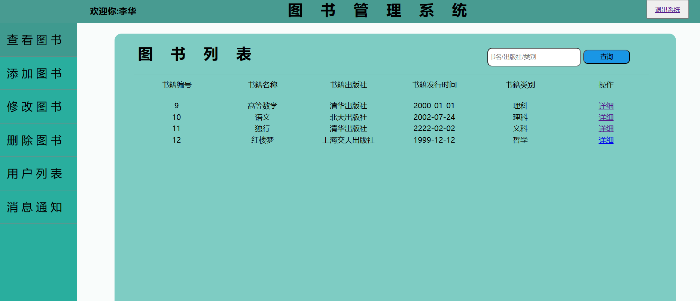

# BookManageSystem
图书管理系统
（基于spring+mybatis+springMvc)
# 项目简介
本图书管理系统基于spring,spring mvc,mybatis,数据库为mysql。前端使用了HTML+Css+JS。
# 系统功能
该系统实现读者和管理员登陆，图书的增加，删除，查找，更改，读者的增删改查，密码查看等功能。
# 说明
如果使用该项目出现问题，请联系我 Liliangliang7659@163.com
如果该项目对您有帮助,请star鼓励我。
# 项目截图
登陆页面

管理员页面——查看图书列表

管理员页面——查看图书列表

